# TAMURAT Iteration 3 Report
&nbsp;
#### Scrum Master: &ensp;&ensp; Yixu Chen 

#### Product Owner: &ensp;    Feiyan Yu
&nbsp;

[GitHub repo: https://github.com/teamtreenewbee](https://github.com/teamtreenewbee)

[Pivotal Tracker: https://www.pivotaltracker.com/n/projects/2318271](https://www.pivotaltracker.com/n/projects/2319401)

[Heroku: https://serene-lowlands-61019.herokuapp.com/](https://serene-lowlands-61019.herokuapp.com/)

&nbsp;

#### Team member(alphabetical order):

- Boquan Tao
- Feiyan Yu
- Lijiu Liang
- Shibo Wang
- Yixu Chen
- Zheyong Sun

#### Meeting Time

10:30 am - 12:00 am, Apr 12 2019, HRBB 515

Next meeting：10：30 am, Apr 26 2019, HRBB 515
&nbsp;
# Our Progress

The reconstruction of the whole app was completed. Our app now implement all the features of the old version, as well as some new feature.
In order to support new features (privilege in Scenarios, upload files in Questionnaire), we expand the scheme of database. 
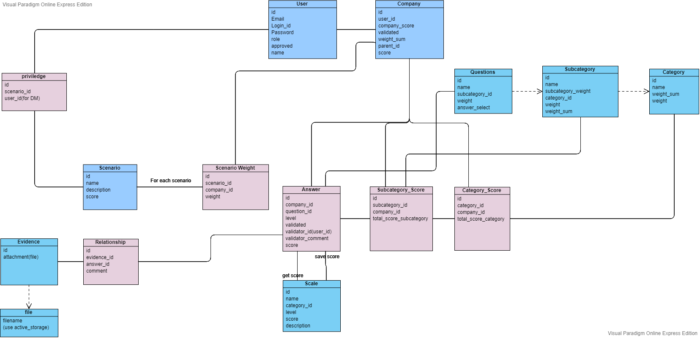
&nbsp;
Admin can assign scenarios to specific decision makers now. And decision makers can only see scenarios related to themselves.
In addition, user's role is desplayed on navigation bar now.
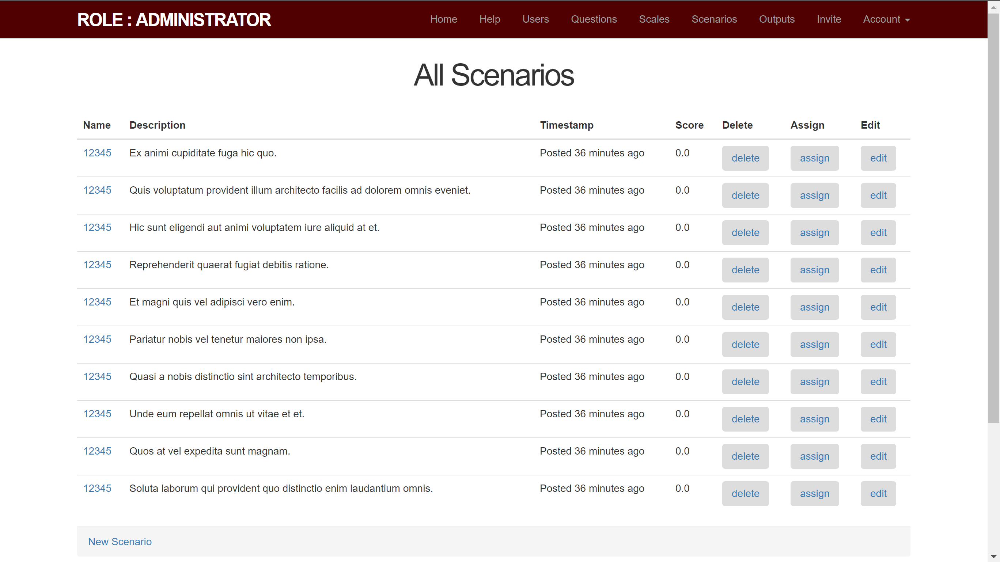
&nbsp;
The dependencies is shown in a JStree in Outputs.
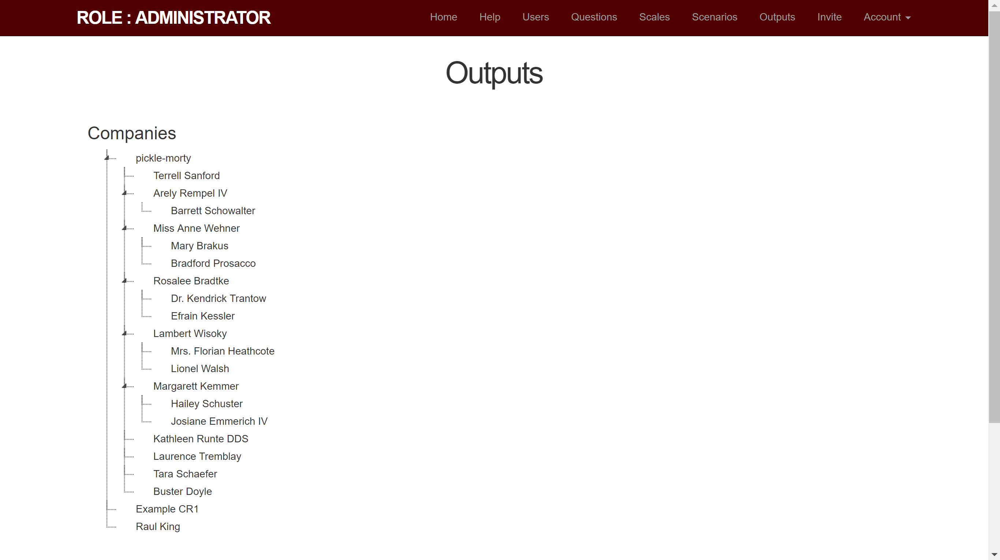
&nbsp;
Admin can invite other people to be an admin.
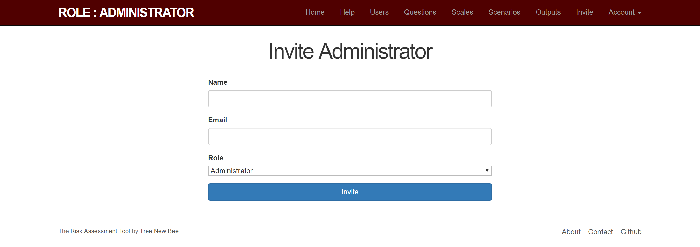
&nbsp;
Validators can see the list of companies needed to validate in Companies. Validators can see companies' questionnairs.
In addition, questionnairs now can remain opened/folded after operations.
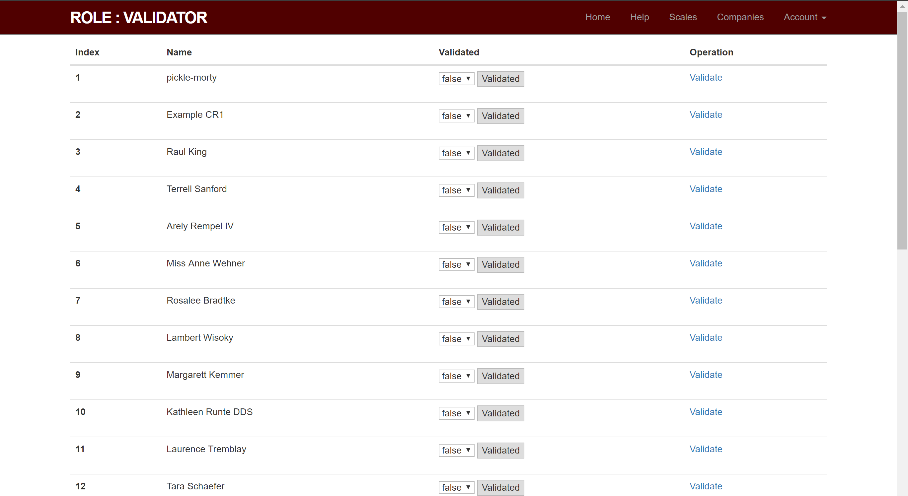
&nbsp;
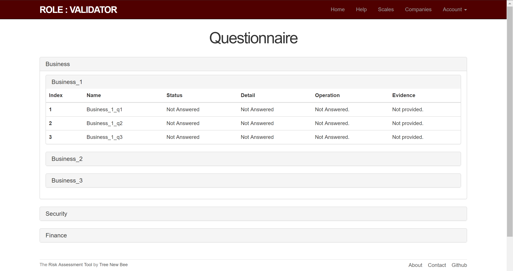
&nbsp;
The features of company representative are implemented.
Company representative can see the scales, while they cannot edit scales.
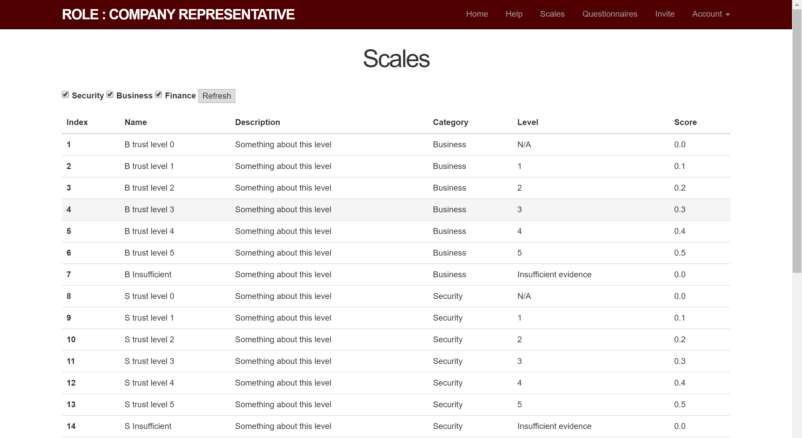
&nbsp;
Company representative can answer questions in Questionnaire.
Company representative can upload files as evidence for each question.
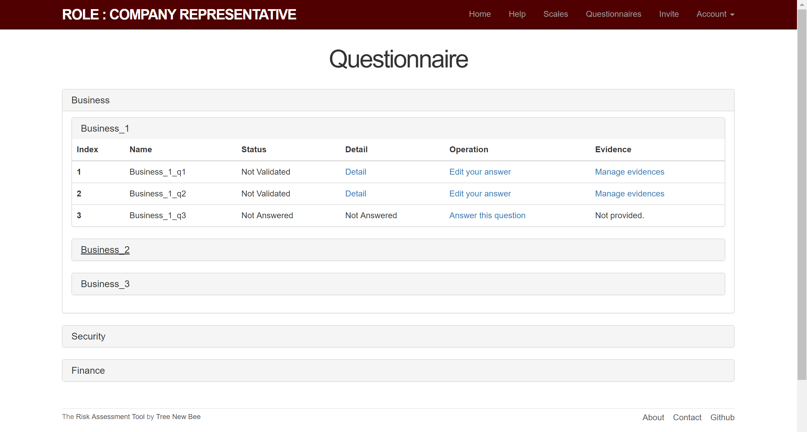
&nbsp;
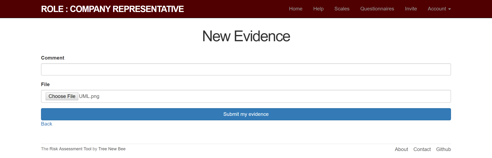
&nbsp;
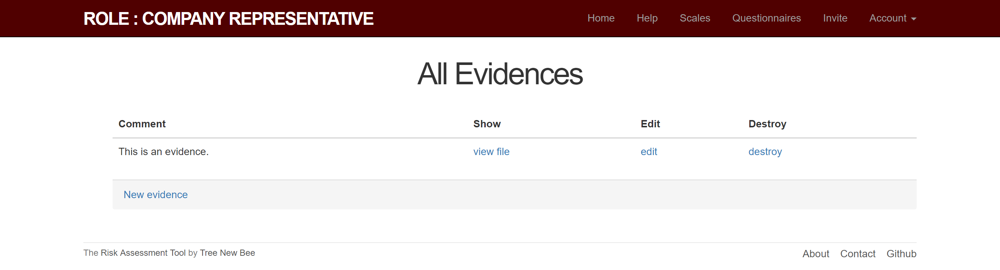
&nbsp;
Company representative can invite other people to be sub-company.
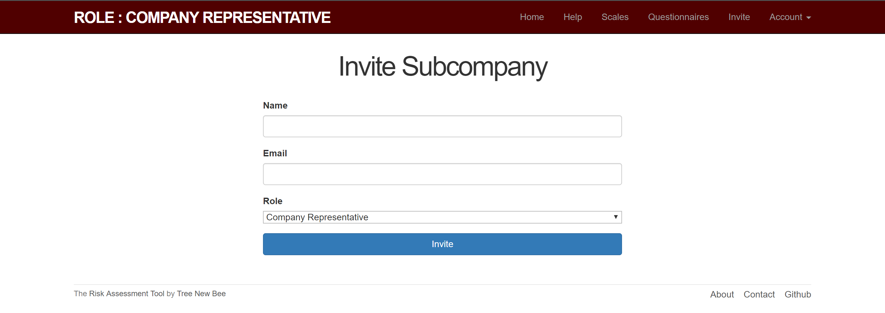
&nbsp;
The coverage of cucumber and rspec test now is 59.87%.
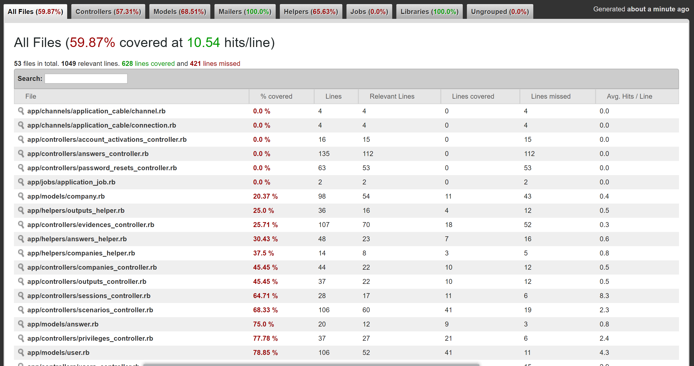

&nbsp;
&nbsp;

&nbsp;
&nbsp;
## Existing User Stories
&nbsp;
### Contractor & Subcontractor Feature
&nbsp;
#### Feature 1: Company user could upload pdf
- As a company user
- I want to upload several pdf documents as my company evidence
- So that validator can see or download them
---
#### Feature 2: Company could be evaluated by answering questions
- As an company user
- So that I could be admitted
- I want to fill the questions(csv file) to get evaluated
---
#### Feature 3: Contractors invite subcontractors via email
- As a contractor
- So that I need to add subcontractor
- I want to have a separate page to invite subcontractor via email
---
### Admin Feature
&nbsp;
#### Feature 4: Admin could approve subcontractor invitation and send log in id & default password through email
- As an admin
- So that I could decide whether subcontractor could register or not
- I want to approve subcontractor invitation and send user id and default pw via email
---
#### Feature 5: Admin edit questions(decision maker cannot)
- As an admin
- So that I can provide my desired questions
- I want to edit questions.
---
#### Feature 6: Admin sets certain scenarios for decision maker
- As an admin
- So that I want different decision makers to evaluate differently
- I wan to restrict the scenarios decision makers can see
---
### Decision Maker Feature
&nbsp;
#### Feature 7: Decision Maker and Admin could set up scenario
- As an Decision Maker or Admin
- So that I could set up scenario
- I want to give each scenario a name and description
---
#### Feature 8: Decision Maker change companies weight at different scenarios
- As a Decision Maker
- So that I could evaluate companies weight depends on scenarios
- I want to give or change companies weight according to different scenarios
---
#### Feature 9: Decision Maker could change question weights
- As a Decision Maker
- So that I could evaluate each question
- I want to give or change questions weights
---
### Validator Feature
&nbsp;
#### Feature 10: Evaluate company
- As a validator
- So that i could evaluate subcontractors and contractor
- I want to give level(drop down), comments(text box), weight of company(text box), weight of question(text box)
---
#### Feature 11: More than one validators
- As a decision maker or validator
- So that I could see other validation of questions
- I want to see who validates which question
---
#### Feature 12: Re-validates a company when it changes the answers
- As a validator
- So that I can validates a company more accurately
- I want to re-validate a company
---

### Function Feature
&nbsp;
#### Feature 13: Users could register account
- As a contractor or decision-maker or validator
- So that I could register an account
- I want to fill my email, nickname(company name/validator name), password and role and wait for the log in id sent by admin via email.
---
#### Feature 14: Users could contract admin for support
- As a user
- So that I may meet problems and need help
- I want to have a button to contract admin for support
---
#### Feature 15: Forget and reset password
- As a user or admin
- So that I may forget or want to change password
- I want to reset password via email
---
#### Feature 16: Notice if password incorrect
- As a user
- So that I want to get notice when password incorrect
- a flash will jump up when password incorrect to note user or admin
- ---
